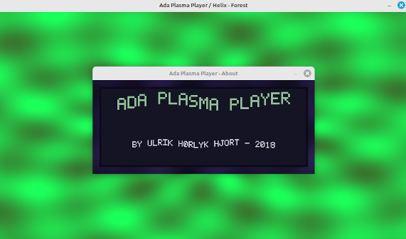

# Ada Plasma MP3 Player



Ada MP3 player for Linux with music-reactive plasma visuals.
It uses:

- Ada for the main application logic
- libmpg123 for MP3 decoding
- SDL2 for windowing, rendering, input, and audio output
- ffmpeg for optional MP4 export

## Features

- Play a MP3 file with animated plasma graphics
- Optional spectrum bars
- Multiple plasma patterns
- Multiple color palettes
- Automatic pattern and color switching based on music changes
- Offline export to MP4 with audio
- Simple playlist wrapper script for playing many songs in sequence

## Requirements

- gnatmake
- gprbuild
- gcc
- SDL2 development files
- libmpg123 development files
- ffmpeg (only needed for MP4 export)


```bash
sudo apt install gnat gprbuild gcc libsdl2-dev libmpg123-dev ffmpeg
```

## Build

From the project directory:

```bash
make
```

or build through the project file:

```bash
mkdir -p obj bin
gprbuild -P mp3player.gpr
```

This creates the executable at:

```text
bin/plasma_player
```

## Usage


```bash
./bin/plasma_player /path/to/song.mp3
```

To choose a different window size:

```bash
./bin/plasma_player --window-size 1280x720 song.mp3
```

To show an intro title card with the song name for the first few seconds:

```bash
./bin/plasma_player --intro-overlay song.mp3
```

Add an author name to that intro card:

```bash
./bin/plasma_player --intro-overlay --name="Ulrik Hørlyk Hjort" song.mp3
```

To make automatic switching slower or faster, set the cooldown in milliseconds:

```bash
./bin/plasma_player --auto-cooldown-ms 900 song.mp3
```

## Controls

- Space: pause or resume
- A: toggle spectrum bars
- P: next plasma pattern
- C: next color palette
- S: toggle color strobe
- M: toggle automatic pattern and color switching
- R: restart track
- Left mouse click: toggle the animated about window
- Esc: quit

Automatic switching is on by default.

The spectrum bars show the current frequency spectrum of the music. From left
to right, the bars go from low bass up to high treble. A taller bar means that
frequency range is stronger in the recent audio. Internally, the player
analyzes a short rolling window of the decoded PCM, splits it into 48
logarithmically spaced bands from about 40 Hz to 12 kHz, and smooths the
result a bit so the bars do not flicker too harshly.

## Record to MP4

To render a video file with the plasma visuals and the MP3 audio:

```bash
./bin/plasma_player --record plasma.mp4 song.mp3
```

Record mode can be combined with a custom auto-switch cooldown:

```bash
./bin/plasma_player --record plasma.mp4 --auto-cooldown-ms 1200 song.mp3
```

The render size used for playback and MP4 export can be set by:

```bash
./bin/plasma_player --window-size 1280x720 --record plasma.mp4 song.mp3
```

The intro title card can also be included in MP4 export:

```bash
./bin/plasma_player --intro-overlay --record plasma.mp4 t.mp3
```

This uses ffmpeg to create an MP4 with:

- H.264 video
- AAC audio

In record mode, automatic switching is enabled by default so the exported video changes visuals as the music changes.

Example of mp4 recording: [recording](https://www.youtube.com/watch?v=SRYWhsTDb7w)

## Playlist wrapper

The player it self stay single-track on purpose. That keeps playback and MP4 export simple.

For a a playlist, use the shell wrapper:

```bash
./plasma_playlist.sh song1.mp3 song2.mp3 song3.mp3
```

It run the player once per file in a loop.

To repeat the playlist forever:

```bash
./plasma_playlist.sh --loop song1.mp3 song2.mp3 song3.mp3
```

## Notes
- Default window size is 960x540.
- Spectrum bars are off by default.
- Automatic switching is on by default.
- The default auto-switch cooldown is 900 ms.
- The visualizer is tuned for energetic music and works well with techno style tracks.
